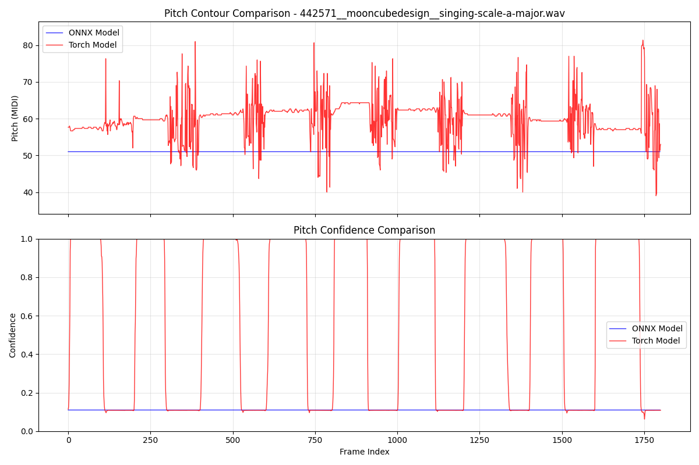

# ONNX Export Experiment Summary

## Overview

This document summarizes an attempt to export the PESTO pitch estimation model to ONNX format for improved deployment flexibility and performance optimization. The experiment ultimately failed due to architectural incompatibilities with ONNX's stateless execution model.

## Experiment Setup

The experiment involved:
1. Exporting the trained PyTorch PESTO model to ONNX format using `torch.onnx.export()`
2. Running inference on the same audio file (`442571__mooncubedesign__singing-scale-a-major.wav`) with both models
3. Comparing pitch contour and confidence outputs between the original PyTorch model and the exported ONNX model

## Results

The comparison revealed critical differences between the two models:

### Pitch Contour Output
- **PyTorch Model**: Produced expected pitch variations tracking the audio content (40-80 MIDI range)
- **ONNX Model**: Generated a flat response around 50 MIDI, indicating complete failure to track pitch

### Pitch Confidence
- **PyTorch Model**: Showed appropriate confidence spikes (0.0-1.0) corresponding to detected pitch events
- **ONNX Model**: Exhibited consistently low confidence (~0.1) across all frames

## Root Cause Analysis

The ONNX export failure stems from **stateful caching layers** in the PESTO architecture:

1. **Cached Convolution Operations** (`pesto/utils/cached_conv.py`): The model uses optimized convolution operations that maintain internal state for efficiency
2. **Streaming Buffer State**: The architecture includes circular buffer implementations for real-time processing
3. **HCQT Temporal Dependencies**: The Harmonic Constant-Q Transform implementation may rely on frame-to-frame state preservation

ONNX requires stateless operations for proper serialization, but PESTO's caching mechanisms fundamentally depend on maintaining state between inference calls.

## Technical Implications

- **State Serialization**: ONNX cannot serialize the internal cache states required for proper model operation
- **Temporal Context Loss**: The exported model loses the temporal continuity essential for accurate pitch tracking
- **Performance Degradation**: Even if export succeeded, the stateless nature would eliminate the performance benefits of caching

## Future Work Recommendations

### Option 1: Stateless Model Variant
- Develop a stateless version of the PESTO architecture
- Remove caching layers and implement alternative optimization strategies
- Trade-off: Potential performance reduction for deployment flexibility

### Option 2: TorchScript Export
- Use PyTorch's JIT compilation (`torch.jit.script()`) instead of ONNX
- Maintains PyTorch ecosystem compatibility while enabling optimization
- Preserves stateful operations and custom layer implementations

### Option 3: Model Distillation
- Train a smaller, stateless student model to mimic PESTO's behavior
- Use the original model as a teacher for knowledge distillation
- Design student architecture specifically for ONNX compatibility

### Option 4: Hybrid Approach
- Export only the core CNN backbone to ONNX
- Implement pre/post-processing and caching in native deployment code
- Combine ONNX inference with custom state management

### Option 5: Custom ONNX Operators
- Implement PESTO's caching operations as custom ONNX operators
- Requires significant engineering effort and runtime support
- May not be portable across all ONNX runtimes

## Conclusion

The ONNX export experiment confirms that PESTO's stateful architecture is fundamentally incompatible with ONNX's execution model. The cached convolution layers that provide the model's efficiency cannot be serialized to ONNX format, resulting in complete failure of the exported model.

For deployment scenarios requiring ONNX compatibility, pursuing the stateless model variant or TorchScript alternatives would be the most viable approaches, though they would require architectural modifications and potential performance trade-offs.