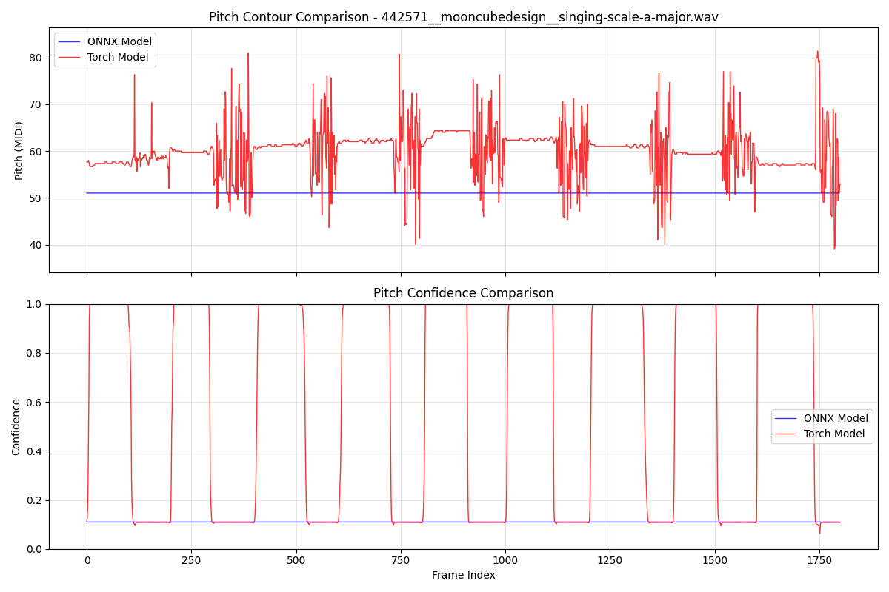
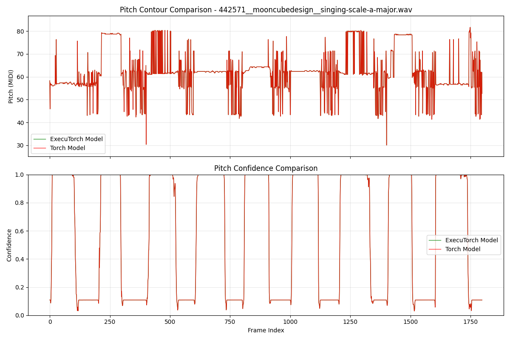
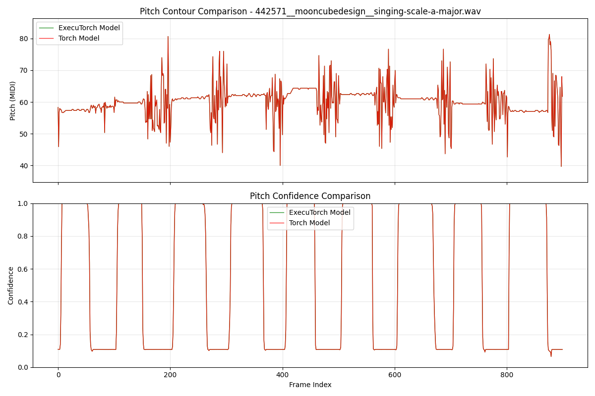
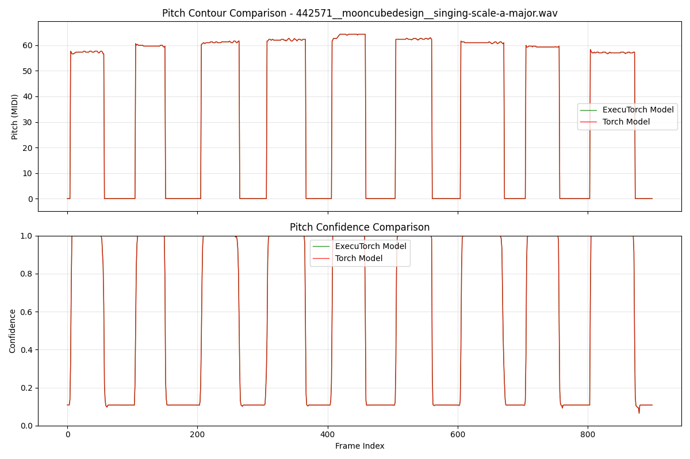

# Model Export Summary

## Overview

PESTO model export experiments comparing ONNX and ExecuTorch deployment formats. Tests used the same audio file to compare pitch contour and confidence outputs between PyTorch and exported models.

## ONNX Export Results

**Status**: Failed ❌

**Issues**:
- PyTorch: Normal pitch tracking (40-80 MIDI)
- ONNX: Flat response at ~50 MIDI
- PyTorch: Confidence spikes (0.0-1.0) 
- ONNX: Low confidence (~0.1)

**Root Cause**: PESTO's stateful caching layers (`cached_conv.py`, streaming buffers, HCQT temporal dependencies) are incompatible with ONNX's stateless requirements.

## ExecuTorch Export Results

**Status**: Success ✅

### Experiment Evolution

**Step 1 - Initial Export**: 
Misleading results due to different processing methods (continuous vs chunked).

**Step 2 - Fair Comparison**: 
Perfect alignment achieved when both models use identical streaming processing.

**Step 3 - Realtime Optimization**: 
Removed chunk overlap to simulate realtime audio callbacks, improving stability.

**Step 4 - Confidence Filtering**: 
Added configurable threshold filtering (default: 0.3) to remove low-confidence predictions.

**Final Result**: ExecuTorch preserves PyTorch behavior perfectly with optimized processing.

### Implementation Details

**Export Process**:
1. Model loading with `streaming=True` and `max_batch_size=1`
2. `torch.export.export()` → `to_edge_transform_and_lower()` with XnnpackPartitioner
3. ExecuTorch runtime with `program.load_method("forward")`

**Key Fixes**:
- Batch size alignment for cached convolutions
- Deterministic testing with C4 sine wave (261.63 Hz)
- Identical streaming processing for fair comparison

**Files**: `realtime/export_pte.py`, `realtime/test_pte.py`, `.gitattributes`

## Technical Comparison

**Why ExecuTorch Succeeded vs ONNX Failed**:

- **ONNX**: Requires stateless operations, breaks cached convolutions
- **ExecuTorch**: Preserves PyTorch execution semantics and stateful operations
- **Root Cause**: ONNX needs static analysis; ExecuTorch uses trace-based export

## Recommendations

**ExecuTorch (Recommended)**:
- ✅ Mobile/edge deployment ready
- ✅ Performance and accuracy preserved
- Future: Test other backends (Core ML, Vulkan), quantization

**ONNX Alternatives (if needed)**:
- Create stateless model variant (performance cost)
- Model distillation for ONNX-specific training

## Conclusion

**ExecuTorch succeeds, ONNX fails** due to PESTO's stateful architecture.

**Key Results**:
- **ExecuTorch**: Perfect PyTorch behavior preservation
- **ONNX**: Complete failure (flat pitch response, low confidence)  
- **Optimization**: Non-overlapping chunks + confidence filtering for streaming apps

**Recommendation**: Use ExecuTorch for production deployment with realtime processing optimizations.