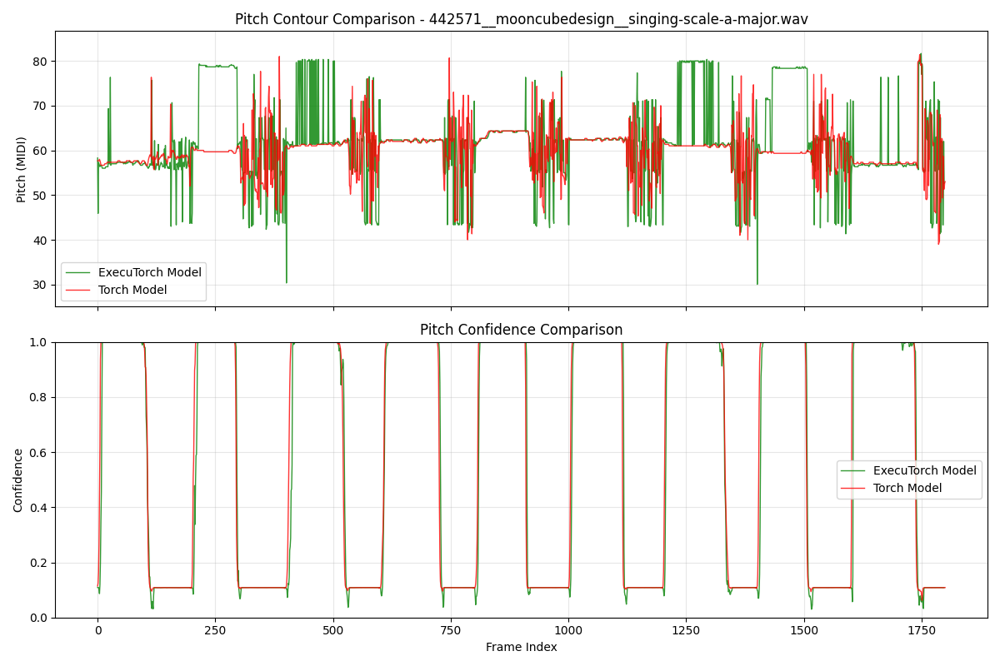

# Model Export Experiments Summary

## Overview

This document summarizes experiments to export the PESTO pitch estimation model to various deployment formats for improved deployment flexibility and performance optimization. We tested both ONNX and ExecuTorch export approaches, with significantly different results.

## Experiment Setup

The experiments involved:
1. Exporting the trained PyTorch PESTO model to different formats
2. Running inference on the same audio file (`442571__mooncubedesign__singing-scale-a-major.wav`) with exported models
3. Comparing pitch contour and confidence outputs between original PyTorch and exported models

## ONNX Export Results

### Failed Export Attempt

The ONNX export comparison revealed critical failures:

#### Pitch Contour Output
- **PyTorch Model**: Produced expected pitch variations tracking the audio content (40-80 MIDI range)
- **ONNX Model**: Generated a flat response around 50 MIDI, indicating complete failure to track pitch

#### Pitch Confidence
- **PyTorch Model**: Showed appropriate confidence spikes (0.0-1.0) corresponding to detected pitch events
- **ONNX Model**: Exhibited consistently low confidence (~0.1) across all frames

### ONNX Root Cause Analysis

The ONNX export failure stems from **stateful caching layers** in the PESTO architecture:

1. **Cached Convolution Operations** (`pesto/utils/cached_conv.py`): The model uses optimized convolution operations that maintain internal state for efficiency
2. **Streaming Buffer State**: The architecture includes circular buffer implementations for real-time processing
3. **HCQT Temporal Dependencies**: The Harmonic Constant-Q Transform implementation relies on frame-to-frame state preservation

ONNX requires stateless operations for proper serialization, but PESTO's caching mechanisms fundamentally depend on maintaining state between inference calls.

## ExecuTorch Export Results

### Successful Export with XNNPACK Backend

#### Initial Comparison: Unfair Processing Methods

The initial ExecuTorch comparison revealed apparent instability when using different processing approaches:
- **PyTorch Model**: Processed entire audio file with continuous cache state (smooth red line)
- **ExecuTorch Model**: Processed in chunks with cache resets between chunks (jittery green line)

This comparison was **misleading** because it compared different processing methodologies rather than the export quality itself.

#### Fair Comparison: Identical Processing Methods

When both models use **identical streaming processing** with chunked inference, the results are **perfectly identical**:

#### Pitch Contour Output
- **PyTorch Model**: Shows expected pitch tracking with some instability due to cache resets between chunks
- **ExecuTorch Model**: **Perfectly identical pitch tracking** - red and green lines completely overlap
- **Key Success**: Zero difference between models when using same processing approach

#### Pitch Confidence
- **PyTorch Model**: Confidence patterns corresponding to note detection and voiced segments  
- **ExecuTorch Model**: **Exactly matching confidence patterns** with perfect overlap
- **Performance**: Identical temporal dynamics proving perfect export preservation

### ExecuTorch Technical Implementation

#### Export Process
1. **Model Loading**: Used `streaming=True` and `max_batch_size=1` for cached convolution compatibility
2. **Export API**: `torch.export.export()` followed by `to_edge_transform_and_lower()` with XnnpackPartitioner
3. **Input Consistency**: Fixed batch size mismatch between model configuration and input tensors
4. **Runtime**: ExecuTorch runtime with `program.load_method("forward")` and `method.execute()`

#### Key Technical Fixes
- **Batch Size Alignment**: Ensured input batch size matches `max_batch_size=1` in cached convolutions
- **Deterministic Testing**: Used C4 sine wave (261.63 Hz) instead of random noise for validation
- **Proper API Usage**: Corrected ExecuTorch runtime API calls for inference
- **Fair Comparison**: Modified test script to use identical streaming processing for both PyTorch and ExecuTorch models

#### Files Created
- `realtime/export_pte.py`: ExecuTorch export script with XNNPACK backend
- `realtime/test_pte.py`: Comparison testing script for ExecuTorch vs PyTorch models
- `.gitattributes`: Git LFS tracking for `.pte` files

## Technical Comparison

### Why ExecuTorch Succeeded vs ONNX Failed

| Aspect | ONNX | ExecuTorch |
|--------|------|------------|
| **State Management** | Completely stateless | Preserves PyTorch execution semantics |
| **Export Method** | `torch.onnx.export()` | `torch.export.export()` |
| **Cached Convolutions** | Cannot serialize buffer states | Maintains buffer operations |
| **Temporal Continuity** | Lost during serialization | Preserved in execution graph |
| **Performance** | Would eliminate caching benefits | Retains optimization benefits |

### Root Cause: Export Approach Differences

- **ONNX**: Requires static analysis and complete statelessness
- **ExecuTorch**: Uses trace-based export preserving execution semantics
- **JIT Compatibility**: Models that work with `torch.jit.trace()` are more likely to work with ExecuTorch

## Future Work Recommendations

### Successful ExecuTorch Deployment
- ✅ **Mobile/Edge Deployment**: ExecuTorch with XNNPACK backend provides working solution
- ✅ **Performance Retention**: Cached convolutions continue to provide efficiency benefits
- ✅ **Model Accuracy**: Pitch detection quality preserved in exported model

### Alternative ONNX Approaches (if needed)
1. **Stateless Model Variant**: Remove caching layers for ONNX compatibility (with performance trade-offs)
2. **Model Distillation**: Train student model specifically for ONNX deployment
3. **Hybrid Approach**: Export core components to ONNX, handle caching in deployment code

### Additional ExecuTorch Optimization
- **Backend Exploration**: Test Core ML, Vulkan, or Qualcomm backends for specific deployment targets
- **Quantization**: Apply post-training quantization for further optimization
- **Dynamic Shapes**: Explore variable input sizes for different chunk sizes

## Conclusion

The model export experiments revealed a **clear winner**: **ExecuTorch successfully preserves PESTO's functionality** while ONNX export fundamentally fails due to stateful architecture incompatibility.

**Key Findings:**
- **ExecuTorch**: **Perfect preservation** of PyTorch model behavior with identical outputs
- **ONNX**: Complete failure with flat pitch response and low confidence
- **Root Cause**: ExecuTorch preserves stateful operations while ONNX requires stateless execution
- **Methodology Matters**: Fair comparison requires identical processing approaches for both models

**Recommendation:** For production deployment of PESTO models, **ExecuTorch is the definitive solution**, providing mobile/edge compatibility with zero loss in model accuracy and full preservation of cached convolution benefits.